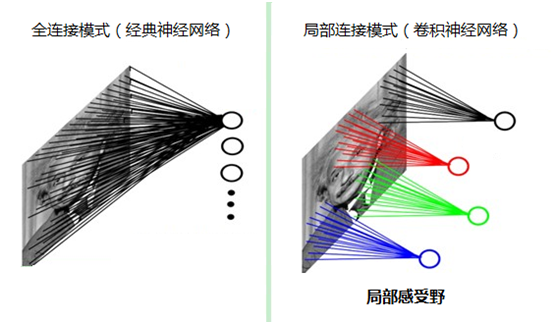
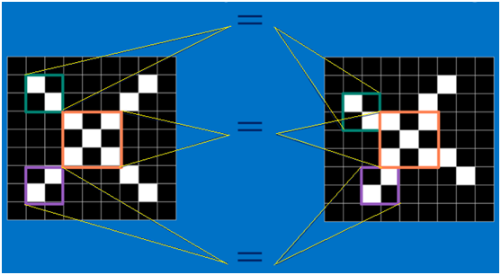
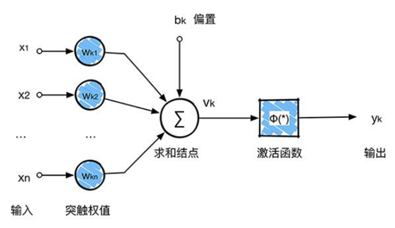
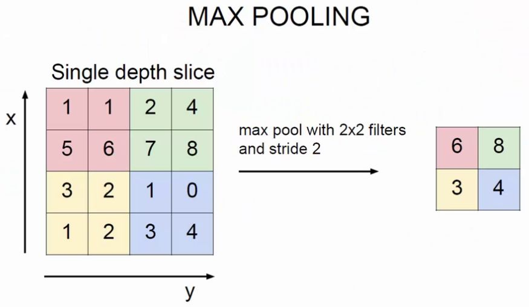
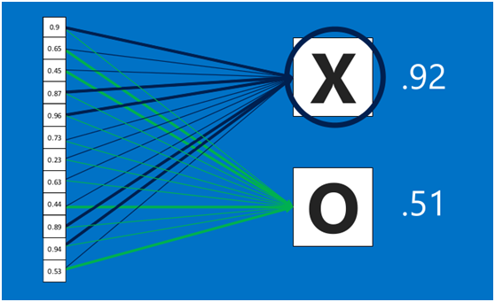
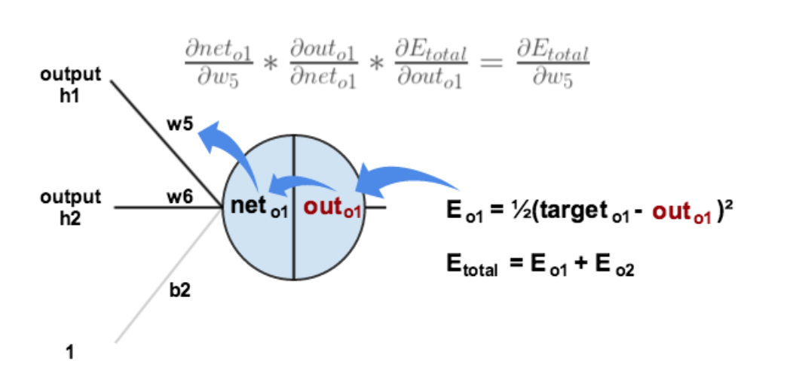
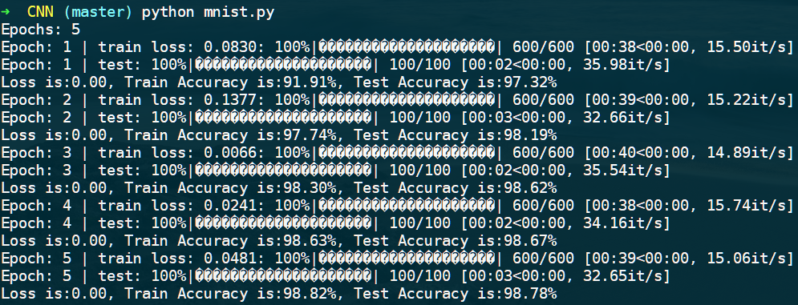
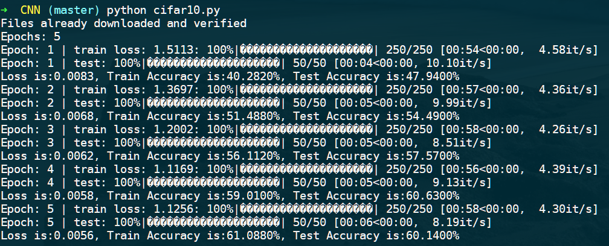

# PyTorch + CNN 应用实践

## 相关概念

### CNN

卷积神经网络相比经典神经网络模型更注重局部信息，每个神经元只对局部信息进行感知，然后在更高层将局部的信息综合起来就得到全局的信息。



### 卷积层

卷积的目的就是在原始的输入上进行特征的提取。使用多个 filter 对多个特征进行提取，最终从不同尺寸和深度的数据得到多个深度为 1 的特征图。

通过设定多个卷积层可以分别提取不同层次的特征，比如在手写体数字识别的案例中，第一层卷积层可以先提取横线、竖线和斜线的特征，然后在第二层提取各种弧线特征，因此越往后的卷积层，特征的个数会越多，也就是神经元的个数会越多。

另外通过卷积操作后，数据的规模可能会发生变化，但可以通过添加 padding 的方式使得卷积前后数据规模不发生改变。如一般的卷积核尺寸为 3\*3，可以添加尺寸为 1 的padding，如果卷积核尺寸为 5\*5，则相应的可以添加尺寸为 2 的padding。



### 激活函数

常用的激活函数有 sigmoid、tanh、relu 等等，前两者 sigmoid/tanh 比较常见于全连接层，后者 ReLU 常见于卷积层。

 在卷积神经网络中，激活函数一般使用ReLU(The Rectified Linear Unit，修正线性单元)，它的特点是收敛快，求梯度简单。计算公式也很简单，max(0,T)，即对于输入的负值，输出全为0，对于正值，则原样输出。



### 池化层

池化就是将输入图像进行缩小，减少像素信息，只保留重要信息。

池化的操作也很简单，通常情况下，池化区域是2*2大小，然后按一定规则转换成相应的值，例如取这个池化区域内的最大值（max-pooling）、平均值（mean-pooling）等，以这个值作为结果的像素值。



### 全连接层

全连接层在整个卷积神经网络中起到“分类器”的作用，即通过卷积、激活函数、池化等深度网络后，再经过全连接层对结果进行识别分类。首先将经过卷积、激活函数、池化的深度网络后的结果串起来。然后根据模型训练得出来的权重，以及经过前面的卷积、激活函数、池化等深度网络计算出来的结果，进行加权求和，得到各个结果的预测值，然后取值最大的作为识别的结果。跟其他层一样，全连接层也可以有多个 。



### 反向传播

反向传播的原理也很简单，就是通过求导计算出当前模型各层间各权重对误差的贡献值，然后根据该贡献值去调整权重值，然后通过不断的迭代不断的缩小这个总误差，从而达到训练的效果。



## MNIST

MNIST 是一个简单的手写体数字的训练集，其中包含 60000 个训练样本以及 10000 个测试样本，每个样本都是 28*28 像素的灰度图片。

实验通过建立一个 2 个卷积层，2 个激活层，2 个池化层以及 1 个连接层，1 个输出层的模型。

```python
class Model(nn.Module):
    def __init__(self):
        super(Model, self).__init__()
        self.conv1 = nn.Sequential(nn.Conv2d(1, 10, 5, padding=2),   # 卷积
                                   nn.ReLU(),                        # 激活
                                   nn.MaxPool2d(2))                  # 池化
        self.conv2 = nn.Sequential(nn.Conv2d(10, 20, 5, padding=2),  # 卷积
                                   nn.ReLU(),                        # 激活
                                   nn.MaxPool2d(2))                  # 池化
        self.out = nn.Sequential(nn.Linear(7*7*20, 10))              # 全连接

    def forward(self, x):
        x = self.conv1(x)
        x = self.conv2(x)
        x = x.view(x.shape[0], 7*7*20)  # 压缩扁平化处理
        x = self.out(x)
        return x
```

使用 learning_rate=0.001，batch_size=100 的参数进行 5 次迭代后，测试集得到的准确率为：98.78%。



## CIFAR10

CIFAR10 是一个用于图像识别的经典数据集，包含了10个类型的图片。其中包含 50000 个训练样本以及 10000 个测试样本，每个样本都是 32*32 像素的彩色图片。

实验通过建立一个 2 个卷积层，2 个激活层，2 个池化层以及 1 个连接层，1 个输出层的模型。

```python
class Model(nn.Module):
    def __init__(self):
        super(Model, self).__init__()
        self.conv1 = nn.Sequential(nn.Conv2d(3, 16, 5, padding=2),   # 卷积
                                   nn.ReLU(),                        # 激活
                                   nn.MaxPool2d(2))                  # 池化
        self.conv2 = nn.Sequential(nn.Conv2d(16, 32, 5, padding=2),  # 卷积
                                   nn.ReLU(),                        # 激活
                                   nn.MaxPool2d(2))                  # 池化
        self.out = nn.Sequential(nn.Linear(8*8*32, 10))              # 全连接

    def forward(self, x):
        x = self.conv1(x)
        x = self.conv2(x)
        x = x.view(x.shape[0], 8*8*32)  # 压缩扁平化处理
        x = self.out(x)
        return x
```

使用 learning_rate=0.001，batch_size=200 的参数进行 5 次迭代后，测试集得到的准确率为：60.14%。

