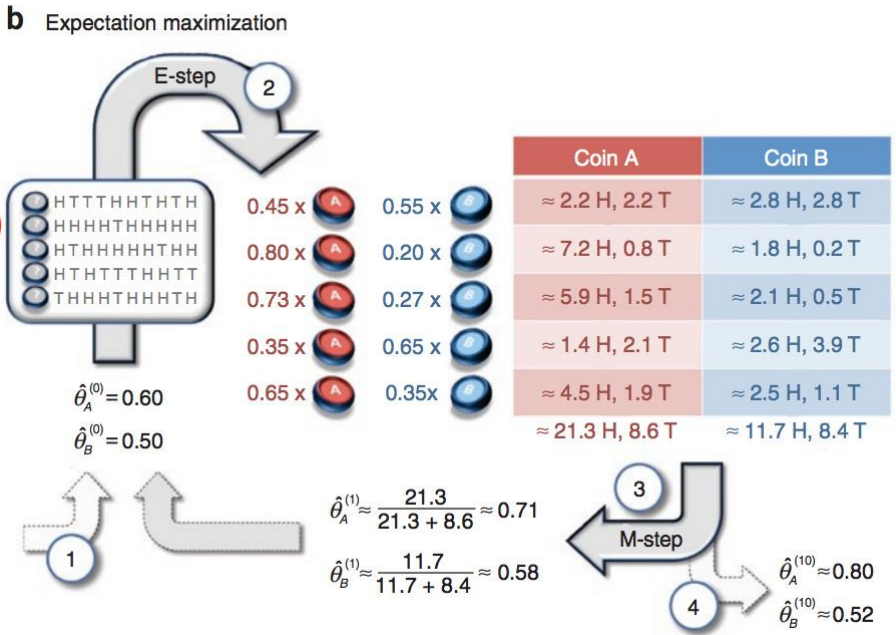
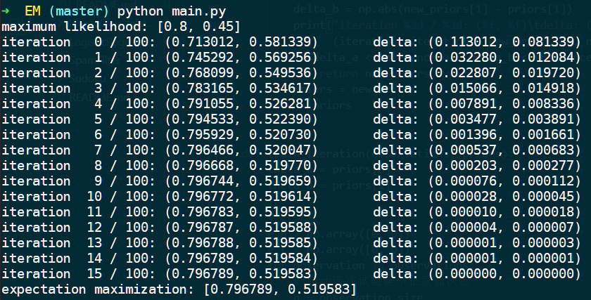

# EM算法

## 情况一


有详细的试验数据，只需要分别统计每个硬币出现正面的次数，并除以每个硬币的总试验次数，即可估计正面出现的概率。

### 定义观察记录

```python
# 用1代表正面，0代表反面
observations = np.array([
    [1, 0, 0, 0, 1, 1, 0, 1, 0, 1],
    [1, 1, 1, 1, 0, 1, 1, 1, 0, 1],
    [1, 0, 1, 1, 1, 1, 1, 0, 1, 1],
    [1, 0, 1, 0, 0, 0, 1, 1, 0, 0],
    [0, 1, 1, 1, 0, 1, 1, 1, 0, 1]
])

# 用0表示硬币A，1表示硬币B
coins = np.array([
    [1, 1, 1, 1, 1, 1, 1, 1, 1, 1],
    [0, 0, 0, 0, 0, 0, 0, 0, 0, 0],
    [0, 0, 0, 0, 0, 0, 0, 0, 0, 0],
    [1, 1, 1, 1, 1, 1, 1, 1, 1, 1],
    [0, 0, 0, 0, 0, 0, 0, 0, 0, 0]
])
```

### 计算概率

分别统计每个硬币出现正面的次数，并除以每个硬币的总试验次数。

```python
def maximum_likelihood(observations, coins):
    prior_a = (observations * (coins - 1)).sum() / (coins - 1).sum()
    prior_b = (observations * coins).sum() / coins.sum()
    return [prior_a, prior_b]

if __name__ == "__main__":
    priors = maximum_likelihood(observations, coins)
    print(priors)
```

## 情况二



没有记录每次试验使用的是哪个硬币。使用EM算法的执行以下两个基本步骤：

1. 计算期望（E），利用概率模型参数的现有估计值，计算隐藏变量的期望；
2. 最大化（M），利用 E 步求得的隐藏变量的期望，对参数模型及进行最大似然估计。
3. M 步找到的参数估计值用于下一次的 E 步计算中，不断迭代此过程直到算法收敛到一定精度时，结束算法。

### E 步骤

使用初始值或上次的估算值 $\theta_A$ 和 $\theta_B$ 计算每一次试验使得出现该结果两个硬币的使用概率 ${p_{A,i}}'$ 和 ${p_{B,i}}'$，以及两个硬币出现正反面次数的期望值 $E_{A,h}$，$E_{A,t}$，$E_{B,h}$，$E_{B,t}$。
$$
p_A = C_n^h\times {\theta_A}^h\times (1-\theta_A)^t\\
p_B= C_n^h\times {\theta_B}^h\times (1-\theta_B)^t\\
{p_A}'= \frac{p_A}{p_A+p_B}\\
{p_B}'= 1-{p_A}'\\
E_{A,h}= \sum {p_{A,i}}'\times h_i\\
E_{A,t}= \sum {p_{A,i}}'\times t_i\\
E_{B,h}= \sum {p_{B,i}}'\times h_i\\
E_{B,t}= \sum {p_{B,i}}'\times t_i
$$

```python
def train_iteration(observations, priors):
    theta_a = priors[0]
    theta_b = priors[1]

    # E 步骤
    e_h = np.array([0, 0])
    e_t = np.array([0, 0])
    for observation in observations:
        # 统计该次试验硬币正反面次数
        n = observation.size
        h_i = observation.sum()
        t_i = observation.size - h_i
        # 计算该次试验分别是硬币A或硬币B的概率
        p_a = comb(n, h_i) * theta_a**h_i * (1-theta_a)**t_i
        p_b = comb(n, h_i) * theta_b**h_i * (1-theta_b)**t_i
        pp = np.array([p_a, p_b]) / (p_a + p_b)
        # 计算期望
        e_h = e_h + pp * h_i
        e_t = e_t + pp * t_i
      
    # ...
```

### M 步骤

根据期望值 $E_{A,h}$，$E_{A,t}$，$E_{B,h}$，$E_{B,t}$ 求出该次迭代后的估算值 ${\theta_A}'$ 和 ${\theta_B}'$ 。
$$
{\theta_A}' = \frac{E_{A,h}}{E_{A,h}+E_{A,t}}\\
{\theta_B}' = \frac{E_{B,h}}{E_{B,h}+E_{B,t}}
$$

```python
def train_iteration(observations, priors):
	# ...

    # M 步骤
    theta_a = e_h[0] / (e_h[0] + e_t[0])
    theta_b = e_h[1] / (e_h[1] + e_t[1])

    return [theta_a, theta_b]
```

## 结果

情况二设置最大迭代次数为10000，收敛约束为1e-6。结果截图如下：



使用最大似然估计得到的结果为：(0.8, 0.45)

使用最大期望估计得到的结果为：(0.796789, 0.519583)

