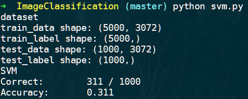

# 分类算法

## 数据集分析

### 数据集下载

从 <http://www.cs.toronto.edu/~kriz/cifar.html> 网站上下载并解压到工作目录中。

其中有 5 个 data_batch 和 1 个 test_batch，每个 batch 中含有 10000 个样本数据。每个单独的样本数据的尺寸是 3072=32\*32\*3，且都是 0 到 255 的整数，显然是每个图像三个通道的像素值。对数据做除以255的操作进行归一化，可以提高处理速度。

### 数据集加载

数据集格式为：

```json
{
    'batch_label': 'training batch 2 of 5', 
    'labels': [], 
    'data': array([[], []]),
    'filenames': ['','']
}
```

需要从中取出 data 和 label 项。

导入后查看训练集和数据集的尺寸。


由于实验机子的性能有限，所以实际上在实验过程中没有用到所有的数据。

## KNN

KNN是一种基本分类和回归方法，是有监督式学习。 给定一个训练数据集，对新的输入实例，在训练数据集中找到与该实例最邻近的K个实例，这K个实例的多数属于某个类，就把实例分到这个类。 

 三要素：距离度量、K值的选择、分类决策规则 

### 距离度量

设特征空间 $X$ 是 $n$ 维实数向量空间 $R^n$，$x_i,x_j\in X$，$x_i=({x_i}^{(1)},{x_i}^{(2)},\dots,{x_i}^{(n)})^T$，$x_j=({x_j}^{(1)},{x_j}^{(2)},\dots,{x_j}^{(n)})^T$，$x_i, x_j$ 的距离 $L_p$ 定义为
$$
L_p(x_i, x_j) = {(\sum_{l=1}^n{|x_i^{(l)}-x_j^{(l)}|}^p)}^{\frac{1}{p}}
$$

这里使用 $p=2$ ，即使用欧氏距离。当 $p=1$ 时为哈密顿距离。

```python
def _compute_distance(self, x):
    x2 = np.sum(x**2, axis=1).reshape(x.shape[0], 1)
    y2 = np.sum(self.x_train**2, axis=1)
    xy = x.dot(self.x_train.T)
    return np.sqrt(x2 + y2 - 2 * xy)
```

### K值的选择

k值较小时， 用较小的邻域的训练实例进行预测，会对这些实例点非常敏感，学习误差变大。

k值较大时，可以减小学习误差。但是与输入较远的点也起到了预测作用，使预测发生错误。

### 分类决策规则

k 近邻法中的分类决策规则往往是多数表决，即由输入实例的 k 个邻近的训练实例中的多数类决定输入实例的类。

### 分类结果

实验中使用 5000 个样本进行训练，使用 1000 个样本进行测试。K 值的选择以及分类的准确率如下：

| K      | 1     | 5     | 10    | 20    | 50    | 100   |
| ------ | ----- | ----- | ----- | ----- | ----- | ----- |
| 准确率 | 0.268 | 0.278 | 0.288 | 0.272 | 0.256 | 0.234 |

| K      | 5     | 7     | 9     | 10    | 11    | 13    |
| ------ | ----- | ----- | ----- | ----- | ----- | ----- |
| 准确率 | 0.278 | 0.288 | 0.294 | 0.288 | 0.285 | 0.283 |

在此样本下，K 取 9 时分类的准确率最高，准确率为 0.294。


## SVM

### 目标函数

求使得几何间隔最大的分离超平面：
$$
x^TW^*+b^*=0
$$
以及相应的分类决策函数：
$$
f(x)=sign(x^TW^*+b^*)
$$
也就是求出  $w$ 和 $b$。

### 线性可分

对于一个简单的线性可分的训练数据集，需要找到一个能够将其每个样本正确分类的超平面。设超平面的法向量为 $W$，截距为 $b$，其方程为 $x^TW+b=0$，则可以通过 ${x_i}^TW+b$ 的值来将数据进行划分，大于 0 的为一类，小于 0 的为另一类。

但符合条件的超平面可能有无穷多个，因此引入了支持向量以及超平面间隔，寻找一个最大间隔超平面，以降低噪声对模型的影响，此超平面是唯一的。在该情况下，存在三个平行的超平面： $x^TW+b=0$， $x^TW+b=1$ 和  $x^TW+b=-1$，通过 ${x_i}^TW+b$ 的值来将数据进行划分，大于 1 的为一类，小于 -1 的为另一类。

其中最大间隔 $\rho = \frac{2}{||W||}$，进而将求解最大间隔问题转化为 
$$
{\max\limits_{W,b}\rho}\leftrightarrow {\max\limits_{W,b}\rho^2}\leftrightarrow \min\limits_{W,b}\frac{1}{2}{||W||}^2
$$
加上约束条件：
$$
x_i^TW+b\ge +1,\; y_i = +1\\
x_i^TW+b\le -1,\; y_i = -1
$$
整合起来，+最大间隔问题的求解即：
$$
\min\limits_{W,b}J(W)=\min\limits_{W,b}\frac{1}{2}{||W||}^2\\
s.t.\quad y_i(x_i^TW + b)\ge 1,\;i=1,2,\dots,n
$$

### 软间隔

如果训练数据并不是严格线性可分的情况下，则需要将寻找最大间隔超平面的条件放宽，以允许少量样本不满足 $y_i(x_i^TW + b)\ge 1$ 约束。同时引入惩罚项及松弛变量，其中惩罚参数为 $C$，松弛变量为 $\xi_i$，然后求解公式重写为：
$$
min\frac{1}{2}{||W||}^2+C\sum_{i=1}^n\xi_i\\
s.t.\; y_i(x_i^TW + b)\ge 1-\xi_i\\\xi_i\ge0,\;i=1,2,\dots,n
$$

### 对偶问题

上述公式仍然是个凸二次规划问题，通过拉格朗日乘子法将其转换为对偶问题进行求解。
$$
L(W,b,\xi,\alpha,\beta)=\frac{1}{2}{||W||}^2+C\sum_{i=1}^n\xi_i-\sum_{i=1}^n\alpha_i[y_i(x_i^TW+b)-1+\xi_i]-\sum_{i=1}^n\beta_i\xi_i
$$
为求得对偶问题的解，需要先求得该式对 $W$、$b$ 和 $\xi$ 的极小再求对 $\alpha$ 和 $\beta$ 的极大。经推导后得：
$$
\min\limits_{\alpha}\frac{1}{2}\sum_{i=1}^n\sum_{j=1}^n\alpha_i\alpha_jy_iy_jx_i^Tx_j^T-\sum_{i=1}^n\alpha_i\\
\sum_{i=1}^n\alpha_iy_i=0,\\
0\le\alpha_i\le C,\;i=1,2,\dots,n
$$

### SMO算法

高效实现支持向量机的算法是SMO算法，其基本思路是：如果所有变量的解都满足此最优化的KKT条件，那么这个最优化问题的解就得到了。因为KKT条件是该优化问题的充分必要条件。否则，选择两个变量，固定其他变量，针对这两个变量构建一个二次规划问题，这个二次规划问题关于这两个变量的解应该更接近原始二次规划问题的解，因为这会使原始二次规划问题的目标函数值变得更小。重要的是，这时子问题可以通过解析方法求解，这样可以大大提高整个算法的计算速度。子问题有两个变量，一个是违反KKT条件最严重的那一个，另一个由约束条件自动确定。如此，SMO算法将原问题不断分解为子问题并对子问题求解，进而达到求解原问题的目的。
$$
W= \sum_i\alpha_iy_ix_i
$$

### 多分类问题

通过多个SVM的组合可以解决多分类问题。其损失函数可以写成以下表达式：
$$
L_i=\frac{1}{N}\sum_{i}{\sum_{j\neq{y_i}}(\max(0,f(x_i;W)_j-f(x_i;W)_{y_i}+\Delta))}+\lambda||W||^2
$$
梯度为：
$$
\nabla_{w_j}{L_i}=1(w_j^Tx_i-w_{y_i}^Tx_i+\Delta>0)x_i
$$

### 分类结果

实验中使用 5000 个样本进行训练，使用 1000 个样本进行测试。另外，batch_size 为 500，learning_rage 为 1e-5，经过 10000 次迭代后，准确率为 0.311。



## MLP

两层神经网络的损失函数表示为：
$$
L=\frac{1}{n}\sum{-\ln{(Y \circ f(X))}}
$$
偏导为：
$$
\frac{\partial{L}}{\partial{W_2}}=\frac{1}{n}{a^T(f(X)-Y)} \\
\frac{\partial{L}}{\partial{b_2}}=\frac{1}{n}{I_{1,n}(f(X)-Y)} \\
\frac{\partial{L}}{\partial{W_1}}=\frac{1}{n}{X^T\text{ReLU}^{'}(z) \circ ((f(X)-Y)W_2^T)} \\
\frac{\partial{L}}{\partial{b_1}}=\frac{1}{n}{I_{1,n}\text{ReLU}^{'}(z) \circ ((f(X)-Y)W_2^T)} \\
$$

### 分类结果

实验中使用 5000 个样本进行训练，使用 1000 个样本进行测试。另外，隐藏层神经元数量为 100 个，learning_rage 为 1e-5， kernel_regularizer 为 1e-5，同样经过 10000 次迭代后，得到准确率为 0.147。


## 总结

如果根据自己的实验结果来进行三种算法的比较的话，由于不太确定自己的实现是否可靠，以及训练以及测试的标准也不同，因此不太具有说服力。尽管如此，实际上，在实验中 KNN 算法的速度是最快的，因为它不用训练，也不需要迭代，直接计算距离值就可以得出结果。但一般来说，神经网络的准确率是三个当中最好的，其次是 SVM，最后才是 KNN，对于大数据来说更是明显。

另外可以看出三种算法的实验，分类准确率都不是太高，可以通过对数据集进行如灰度处理或边缘检测等预处理，不仅能减少数据集的规模，应该还能在一定程度上提高分类的准确率。