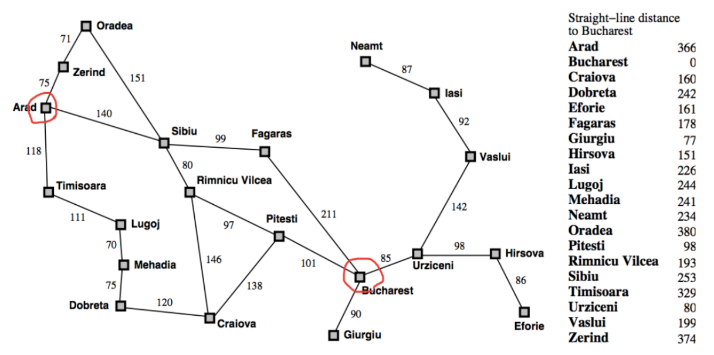

# AI-Assignment

> 数据科学与计算机学院 2017级软件工程 梁文杰 16303050

## 朴素贝叶斯分类器的实现

### 要求

根据给出的一定数量的训练集训练模型（邮件中单词分布情况以及是否为垃圾邮件），然后对测试集数据进行标注，查看标注的准确率的高低。

### 问题分析

朴素贝叶斯分类器是分类算法集合中基于**贝叶斯理论**的一种算法。贝叶斯理论从数学上的表示可以写成这样：
$$
\begin{align} 
P(A|B)=\frac{P(B|A)P(A)}{P(B)} \tag{1}
\end{align}
$$
对于某个存在多个特征值的数据集，多个特征同时决定数据集的类别。如果假设对于每一个特征都是相互独立的，那么归属于某一类的概率可以表示为：
$$
\begin{align} 
P(c_i|x_1, x_2,\cdots ,x_n) =\frac{P(x_1,x_2,\cdots ,x_n|c_i)P(c_i)}{P(x_1,x_2,\cdots ,x_n)}=\frac{P(x_1|c_i)P(x_2|c_i)\cdots P(x_n|c_i)P(c_i)}{P(x_1,x_2,\cdots ,x_n)} \tag{2}
\end{align}
$$
根据上述概率决定数据归属于哪一类，则可以将分类器表示为：
$$
\begin{align}
h(x)= arg\ max_{c\in Y}P(c|x) \tag{3}
\end{align}
$$
将公式（1）代入公式（3）得：
$$
\begin{align}
h(x) = arg\ max_{c\in Y}\frac{P(x|c)P(c)}{P(x)} \tag{4} 
\end{align}
$$
再将公式（2）代入公式（4）得：
$$
\begin{align}
h(x) = arg\ max_{c\in Y}\frac{P(x_1,x_2,\cdots ,x_n|c)P(c)}{P(x_1,x_2,\cdots ,x_n)}=\frac{P(x_1|c)P(x_2|c)\cdots P(x_n|c)P(c)}{P(x_1,x_2,\cdots ,x_n)} \tag{5}
\end{align}
$$
由于给数据分类时只需判断归属哪一类的概率最大，而公式（2）中的分母与类别无关，故分类器简化为：
$$
\begin{align}
h(x) = arg\ max_{c\in Y}P(x_1,x_2,\cdots ,x_n|c)P(c)=P(x_1|c)P(x_2|c)\cdots P(x_n|c)P(c) \tag{6}
\end{align}
$$
先验概率 $P(c)$ 通过以下公式简单求解：
$$
\begin{align}
P(c)=\frac{|D_c|}{|D|}\tag{7}
\end{align}
$$
其中 $|D_c|$ 表示训练集 $D$ 中第 $c$ 类样本组成的集合，从而分类的问题转化为了计算条件概率 $P(x_i|c)$ 的问题，该条件概率可以通过以下公式求解：
$$
\begin{align}
P(x_i|c)=\frac{|D_{c,x_i}|}{|D_c|}\tag{8}
\end{align}
$$
其中 $|D_{c,x_i}|$ 表示 $|D_c|$ 中在第 $i$ 个属性上取值为 $x_i$ 的样本组成的集合。

### 模型平滑

由于存在某些特征出现频率为 0 的情况，所以给条件概率 $P(x_i|c)$ 引入一个 $\lambda$ 常数，使得公式（8）变成：
$$
\begin{align}
P(x_i|c)=\frac{|D_{c,x_i}|+\lambda}{|D_c|+\lambda\cdot N}\tag{9}
\end{align}
$$

- 基本上，只要我们给出了事件B为真，那么就能算出事件A发生的概率，事件B也被称为证据。

其中 $N$ 为第 $c$ 类样本组合中属性的种类数。

### 实现

程序的实现主要为将以上公式翻译成代码，在实现上支持输入不同的训练集以获取不同的先验概率和条件概率，然后输入测试集进行测试，得出测试结果。

### 结果

四次测试输入的训练集规模（邮件的数量）分别为50、100、400、700，测试集规模为260，最终得到的测试结果（分类的准确率）如下表所示：

| Test | Training Set | Spam | Ham  | Testing Set | Spam | Ham  | Accuracy Rate |
| :--: | :----------: | :--: | :--: | :---------: | :--: | :--: | :-----------: |
|  1   |      50      |  25  |  25  |     260     | 130  | 130  | **0.777778**  |
|  2   |     100      |  50  |  50  |     260     | 130  | 130  |  **0.94636**  |
|  3   |     400      | 200  | 200  |     260     | 130  | 130  | **0.969349**  |
|  3   |     700      | 350  | 350  |     260     | 130  | 130  | **0.984674**  |

可以看出，分类的准确率与训练集的数据规模呈正相关关系。

## A\* 算法的实现

### 要求

根据下图的数据建立模型，给出起始位置 $x_0$ 和目标位置 $x_n$ ，求该两点间的最短距离。

### 原理

使用公式 $f(x_1, x_2, x') = g(x_1, x') + h(x', x_2)$ 来近似估计点 $x_1$ 到点 $x_2$ 的距离，其中

- $g(x_1, x')$ ：点 $x_1$ 到点 $x'$ 的实际距离
- $h(x', x_2)$ ：点 $x‘$ 到点 $x_2$ 的估计距离

通过比较在不同点 $x'$ 上函数 $f$ 的值，找出当前最佳的路径。

### 实现

1. 先使用某种数据结构把图在内存中构建起来，导入点、边以及点和点之间直线距离等数据；
2. 根据起始位置到其他位置的直线距离，算出其他位置到目标位置的直线距离；
3. 使用一个优先级队列 $Q$ 保存当前待处理的点以及该点到目标位置估计距离，将起始点 $x_0$ 添加进队列 $Q$ 中；
4. 使用一个集合 $A$ 保存使用过的点以及到达该点的前一个位置，初始为空；
5. 从队列 $Q$ 中取出头部元素（表示目前队列中的所有点，经过该点到目标位置估计距离最短），将该点添加进集合 $A$ 中，计算出与该点相邻且不在集合 $A$ 中的点到目标位置估计距离，并将其值和对应点添加进优先级队列 $Q$ 中；
6. 循环步骤 $5$ 直到从队列 $Q$ 中取出头部元素与目标位置相邻；
7. 从集合 $A$ 中还原出从起始位置到终点位置的路径，并得出最终从起始位置到终点位置的最短距离。

### 结果

Cost：418

Path：Bucharest -> Pitesti -> Rimnicu Vilcea -> Sibiu -> Arad